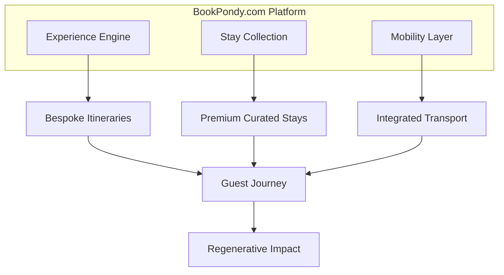
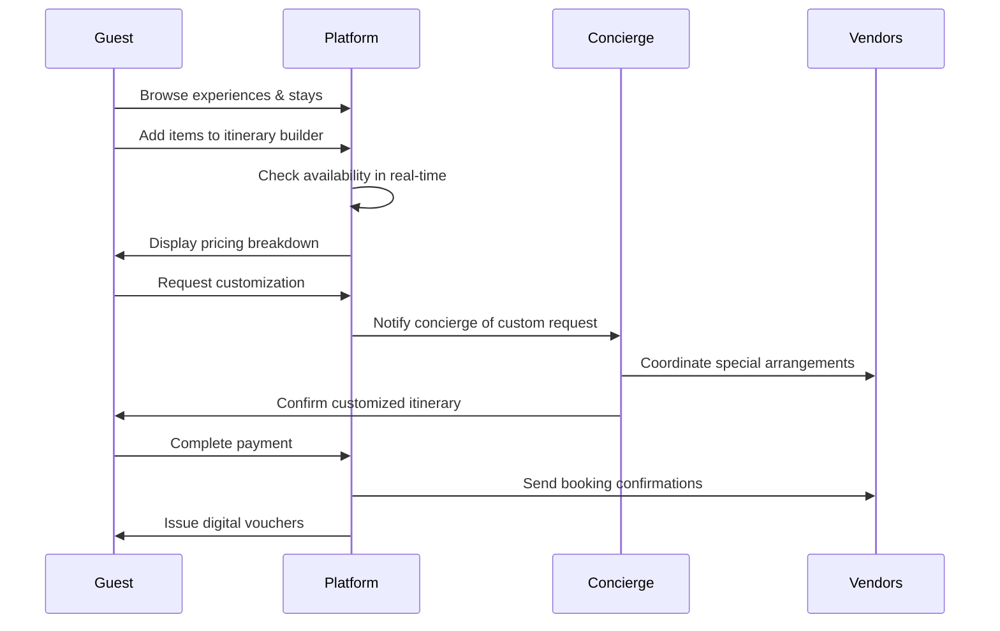
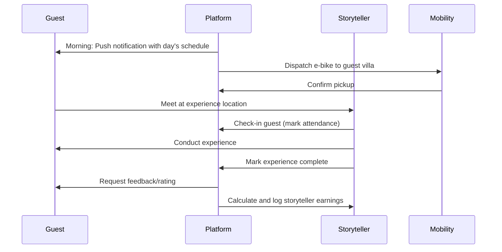
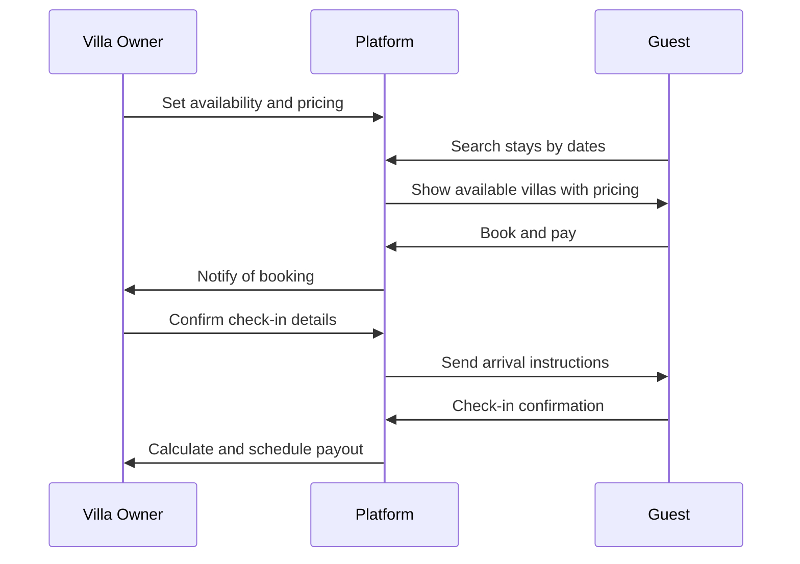
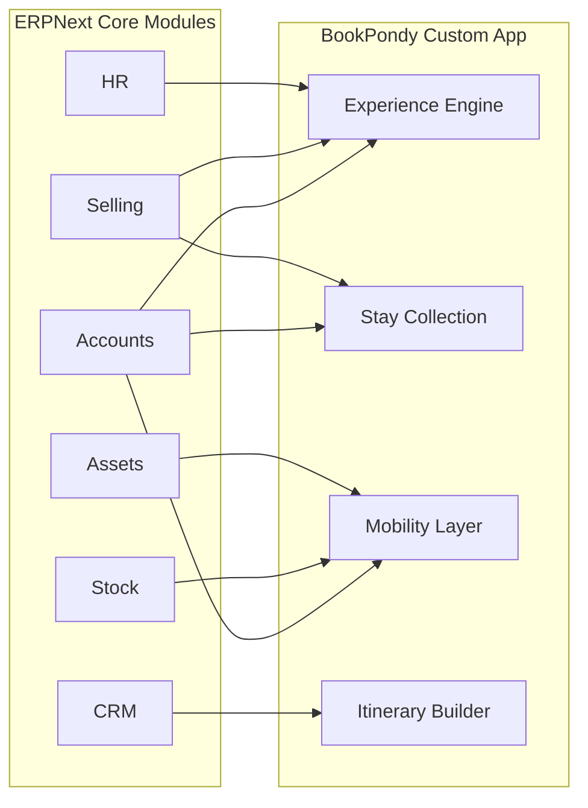
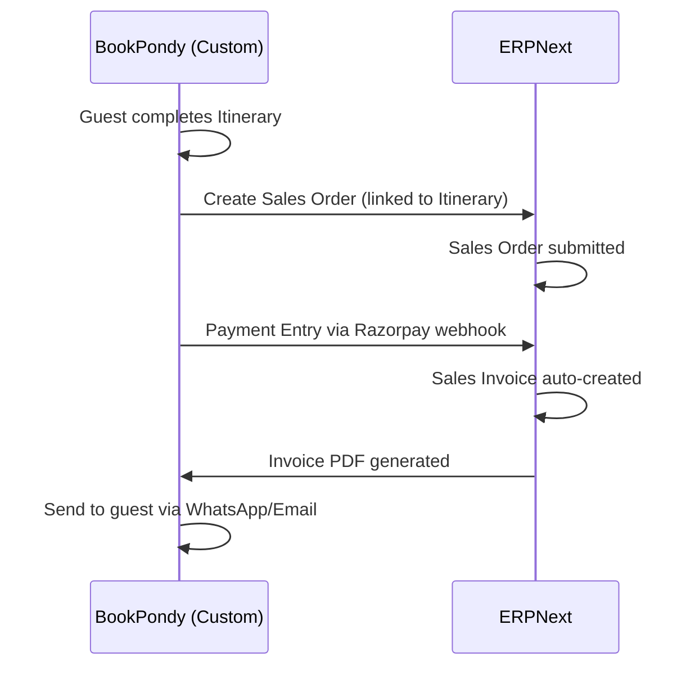
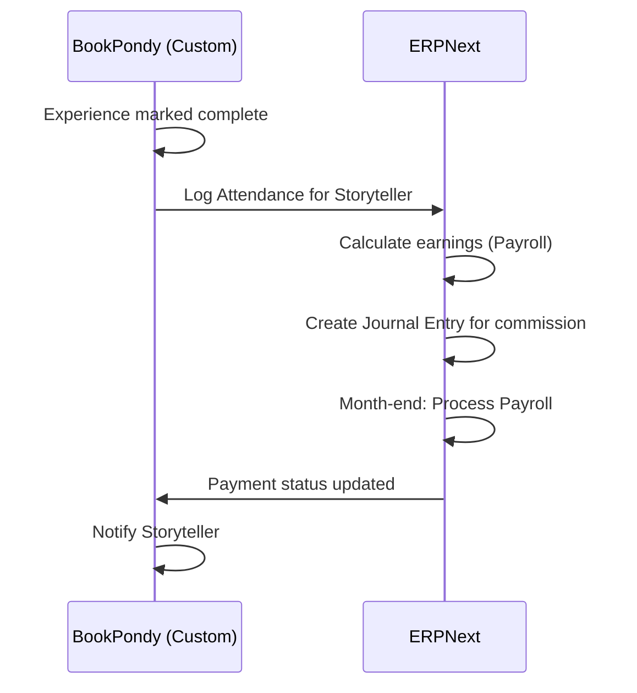
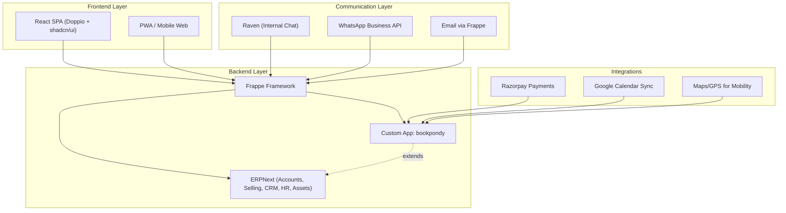

# BookPondy.com — CTO Onboarding Briefing
## Digital Transformation Vision & Technical Requirements

> **From the Desk of the Founder & Creative Director**  
> *Date: February 2026*

---

## Executive Summary

Welcome aboard. You're joining BookPondy.com at a pivotal moment—we're transforming from a manually-operated travel collective into a fully integrated digital platform for bespoke experiences in the Auroville-Puducherry bioregion.

This document serves as your comprehensive briefing on **why we exist**, **what we need to build**, and **how we envision the technical execution**. It follows a structured framework to ensure alignment between vision and implementation.

---

# PART 1: WHY — VISION & PURPOSE

## What Problem Are We Solving and For Whom?

### The Problem
The Auroville-Puducherry corridor contains one of India's most unique cultural, spiritual, and ecological landscapes. Yet travelers currently face:

1. **Fragmented Discovery** — Experiences, stays, and transport are scattered across WhatsApp groups, Google Sheets, and word-of-mouth networks
2. **Lack of Customization** — Standard tour operators offer rigid packages that don't allow for personal narrative design
3. **Opacity in Pricing** — No centralized, transparent pricing; guests rely on intermediaries
4. **Disconnected Logistics** — Booking a villa, a workshop, and transport requires coordinating with 3-5 different parties
5. **No Regenerative Accountability** — Travelers have no visibility into how their money impacts the local community

### Who We Serve

| Persona | Description | Primary Need |
|---------|-------------|--------------|
| **The Conscious Traveler** | 30-50 years, globally mobile, values authenticity over luxury | Curated, meaningful immersions with ethical assurance |
| **The Wellness Seeker** | Seeking retreats, healing, and mindful experiences | Seamless scheduling of yoga, sound healing, forest walks |
| **The Family Explorer** | Parents with children seeking educational holidays | STEAM camps, hands-on workshops, safe mobility |
| **The Cultural Researcher** | Academics, writers, documentary makers | Deep access to artisans, temple rituals, and community leaders |
| **The Group Coordinator** | Corporate or spiritual groups planning retreats | End-to-end logistics with group-specific customizations |

---

## What Does BookPondy.com Do?

> **BookPondy.com is not a booking engine. It is an interpretive gateway that allows guests to design their own narrative through three integrated pillars.**

### The Three Pillars



| Pillar | Current State (Manual) | Future State (Platform) |
|--------|------------------------|-------------------------|
| **Experience Engine** | Itineraries in Google Sheets, confirmations via WhatsApp | Modular itinerary builder with real-time availability |
| **Stay Collection** | Villa bookings through personal contacts, paper invoices | Curated portfolio with live calendars, reviews, transparent pricing |
| **Mobility Layer** | E-bike dispatches via phone calls, car hires through agents | Integrated fleet management, live tracking, dynamic scheduling |

---

## Why Will They Use It Instead of Alternatives?

### Competitive Landscape

| Competitor | What They Offer | Our Differentiation |
|------------|-----------------|---------------------|
| MakeMyTrip/Goibibo | Mass-market bookings | We offer **depth over breadth**—insider access, not package deals |
| Airbnb Experiences | Host-led experiences | Our **storytellers are vetted cultural interpreters**, not random hosts |
| Local Tour Operators | Standard sightseeing | We offer **modular, customizable journeys** with ethical transparency |
| WhatsApp Groups | Ad-hoc coordination | We provide **structured discovery + seamless booking** in one platform |

### Our Unique Value Proposition

1. **Insider Access** — We don't list "Auroville." We unlock the internal artisanal units, the restricted Green Belt trails, the temple rituals closed to regular tourists.
2. **High Customizability** — Guests design their own narrative, selecting from 14+ workshop categories, 4 experience tracks, and 50+ curated properties.
3. **Radical Transparency** — Clear pricing (rack rates updated annually), GST compliance, and visible community fund contributions.
4. **Regenerative Accountability** — Every booking circulates revenue to local storytellers, artisans, and ecological restoration projects.

---

# PART 2: WHAT — CORE REQUIREMENTS

## Current Operational Reality (What We're Replacing)

> ⚠️ **WARNING:** This is the operational chaos we need to systematize. Every tool listed below is a workaround that the platform must replace.

### Current Tool Stack (Manual Operations)

| Function | Current Tool | Pain Points |
|----------|--------------|-------------|
| **Itinerary Planning** | Google Sheets + Docs | Version chaos, no real-time inventory check |
| **Guest Communication** | WhatsApp Business | Conversations lost, no CRM integration, language barriers |
| **Booking Confirmations** | Email + WhatsApp | No centralized tracking, duplicate entries |
| **Availability Tracking** | Google Calendar (shared) | Multiple calendars for villas, guides, vehicles—constant conflicts |
| **Payments** | Razorpay links sent manually | No invoice automation, GST reconciliation is manual |
| **Vendor Coordination** | Phone calls + WhatsApp groups | No unified vendor portal, payment delays |
| **Reporting** | Manual Excel exports | No real-time dashboards, audit nightmares |

---

## System Requirements: What Must the Application Do?

### Core Behaviors (Non-Negotiable)

#### Guest-Facing
- System must allow guests to **discover experiences** by category, date, and interest tag
- System must allow guests to **build modular itineraries** by combining experiences, stays, and transport
- System must allow guests to **view transparent pricing** with breakdowns (experience fee, stay rate, transport, service fee, GST)
- System must allow guests to **make secure payments** with digital invoices and GST compliance
- Users must be able to **communicate with the concierge team** via in-app messaging
- Users must be able to **receive real-time notifications** about booking confirmations, schedule changes, and upcoming experiences

#### Operator-Facing (Internal Team)
- Operators must be able to **manage experience inventory** (slots, guides, capacity)
- Operators must be able to **manage stay availability** with calendar synchronization
- Operators must be able to **assign storytellers/guides** to confirmed bookings
- Operators must be able to **dispatch and track mobility assets** (e-bikes, vehicles)
- System must **auto-generate invoices and receipts** with GST-compliant numbering
- System must provide **real-time dashboards** for bookings, revenue, and vendor payouts

#### Vendor/Partner-Facing
- Vendors must be able to **manage their own availability** (workshops, villas)
- Vendors must be able to **view their booking schedule and payout status**
- System must **auto-calculate vendor payouts** based on commission structures

---

## What Actions Need to Happen? (Key Workflows)

### Workflow 1: Bespoke Itinerary Design



### Workflow 2: Day-of-Experience Execution



### Workflow 3: Villa/Stay Management



---

## What Should the Outcomes Be?

### For Guests
- **Reduced friction**: From 5+ touchpoints to 1 platform
- **Full transparency**: Know exactly where their money goes
- **Personalization**: Feel like the trip was designed just for them
- **Trust**: Professional communication and reliable execution

### For the Business
- **Scalability**: Handle 10x bookings without proportional staff increase
- **Data-driven decisions**: Real-time insights on popular experiences, seasonal trends
- **Financial integrity**: Automated GST compliance and audit-ready reporting
- **Brand building**: Consistent, premium digital experience

### For the Community
- **Fair livelihoods**: Storytellers and vendors see timely, transparent payments
- **Economic impact**: Revenue circulates within the bioregion
- **Skill development**: Youth trained as digital-literate cultural interpreters

---

# PART 3: HOW — PLANNING & IMPLEMENTATION

## Required Stack Components

> ✅ **IMPORTANT:** We are committing to the **Frappe Framework + ERPNext** ecosystem. This is non-negotiable. It provides the ERP backbone, the Python/JavaScript flexibility, and the low-code DocType system we need.

---

## Full ERPNext Integration Strategy

> 🔑 **KEY PRINCIPLE:** We will leverage ERPNext's battle-tested modules for core business operations while building custom DocTypes in the `bookpondy` app for travel-specific functionality. This is NOT "optional extensions"—it's the foundation.

### Why ERPNext?

1. **Mature, Audit-Ready Financials** — General Ledger, GST compliance, multi-currency support out of the box
2. **Inventory Management** — Track assets (e-bikes, vehicles, workshop supplies)
3. **CRM Foundation** — Lead/Customer management with communication history
4. **HR Module** — Manage storytellers as contractors with attendance and payouts
5. **No Wheel Reinvention** — Focus custom development on travel-specific features

### ERPNext Module Mapping



### Detailed Module Usage

| ERPNext Module | BookPondy Use Case | Custom Extensions Needed |
|----------------|--------------------|--------------------------|
| **Accounts** | Sales Invoices, GST filing, Payment Entries, Vendor Payouts | None—use as-is |
| **Selling** | Quotations (custom itinerary quotes), Sales Orders (confirmed bookings) | Link to custom `Itinerary` DocType |
| **CRM** | Leads (inquiries), Customers (guests), Communication Log | Custom fields for guest preferences, travel history |
| **Stock** | Track consumables (workshop materials), manage Batches | Minor—batching for workshop kits |
| **Assets** | E-bikes, vehicles, cameras, audio equipment | Asset maintenance scheduling |
| **HR** | Storytellers as Employees/Contractors, Attendance, Expense Claims | Custom `Storyteller Profile` linked to Employee |
| **Payroll** | Monthly storyteller payouts, commission calculations | Custom salary components |

### Custom DocTypes (BookPondy App)

These are travel-specific entities that ERPNext doesn't cover:

| Custom DocType | Purpose | Links To (ERPNext) |
|----------------|---------|--------------------|
| `Experience` | Catalog of bookable experiences | Item (Selling) |
| `Experience Slot` | Available date/time slots | None (custom scheduling) |
| `Stay Property` | Villa/hotel listings | Item (Selling), Supplier |
| `Stay Booking` | Guest reservation | Sales Order |
| `Itinerary` | Multi-day journey with experiences + stays | Quotation, Sales Order |
| `Itinerary Item` | Child table linking experiences/stays | Sales Order Item |
| `Storyteller Profile` | Extended profile for guides | Employee (HR) |
| `Mobility Asset` | E-bikes, vehicles | Asset (Assets Module) |
| `Mobility Dispatch` | Ride assignments | None (custom) |
| `Guest Feedback` | Post-experience ratings | Communication (CRM) |

### ERPNext Workflow Integrations

#### Booking → Invoice Flow


#### Storyteller Payout Flow


### ERPNext Configuration Requirements

| Setting | Value | Reason |
|---------|-------|--------|
| **Company** | BookPondy Experiences Pvt Ltd | Legal entity |
| **Default Currency** | INR | Primary market |
| **GST Settings** | Enabled, GSTIN: 33AAATA0037B7Z | Compliance |
| **Fiscal Year** | April-March | Indian standard |
| **Stock Settings** | Enable Batches (for workshop materials) | Inventory tracking |
| **Selling Settings** | Enable Quotation required before Sales Order | Itinerary approval flow |

---

### Recommended Architecture



### Stack Specification

| Layer | Technology | Justification |
|-------|------------|---------------|
| **Backend Framework** | Frappe Framework (v15+) | Low-code DocTypes, REST API auto-generation, permissions, workflows |
| **ERP Core** | ERPNext (v15+) | Accounts, Selling, CRM, HR, Assets, Payroll—fully leveraged |
| **Custom App** | `bookpondy` Frappe App | Travel-specific DocTypes extending ERPNext |
| **Frontend** | React (via Frappe Doppio) | Modern SPA experience, Raven as design inspiration |
| **UI Library** | **shadcn/ui** + Tailwind CSS | Beautiful, accessible, copy-paste components |
| **Real-time** | Frappe Socket.io | Live notifications, chat, availability updates |
| **Database** | MariaDB (Frappe default) | Reliable, well-integrated with Frappe |
| **Caching** | Redis | Session management, real-time pub/sub |
| **Payments** | Razorpay | GST-compliant, widely adopted in India |
| **Communication** | Raven (internal) + WhatsApp Cloud API (guests) | Team coordination + guest messaging |
| **Hosting** | Frappe Cloud / Self-hosted (Contabo/DigitalOcean) | Start with Frappe Cloud for simplicity |

---

## Design Inspiration: Raven Architecture Patterns

We will model our frontend architecture on [Raven](https://github.com/The-Commit-Company/raven):

### Frontend Structure (Derived from Raven)

```
frontend/
├── src/
│   ├── components/       # Reusable UI components
│   │   ├── common/       # Buttons, modals, forms
│   │   ├── layout/       # Sidebar, header, navigation
│   │   ├── experience/   # Experience cards, itinerary builder
│   │   ├── stays/        # Villa listings, booking widgets
│   │   └── mobility/     # Fleet status, dispatch views
│   ├── hooks/            # Custom React hooks (useFrappeAPI, useAuth)
│   ├── pages/            # Route-level components
│   ├── types/            # TypeScript interfaces (auto-generated from DocTypes)
│   ├── utils/            # Helper functions
│   ├── App.tsx
│   └── main.tsx
├── package.json
├── vite.config.ts
├── tailwind.config.js
└── index.html
```

### Key Patterns to Adopt from Raven
1. **frappe-react-sdk** for API calls and authentication
2. **SWR/React Query** for data fetching with caching
3. **shadcn/ui components** — pre-built, accessible, Tailwind-styled
4. **Tailwind CSS** with custom design tokens
5. **TypeScript** for type safety between frontend and DocTypes

---

## shadcn/ui Component Strategy

> 🎨 **Design Philosophy:** shadcn/ui gives us beautiful, accessible, copy-paste components built on Radix UI primitives. We own the code—no external dependencies to manage.

### Why shadcn/ui?

1. **Copy-Paste Ownership** — Components live in our codebase, fully customizable
2. **Radix UI Foundation** — Accessibility built-in (WAI-ARIA compliant)
3. **Tailwind CSS** — Consistent with our styling approach
4. **TypeScript** — Full type safety
5. **Active Community** — 440+ components and blocks available

### Components We'll Use (Mapped to Features)

#### Core UI Components
| Component | BookPondy Usage |
|-----------|----------------|
| `button` | CTAs, form submissions, navigation |
| `card` | Experience cards, villa listings, itinerary items |
| `dialog` | Booking confirmations, custom request forms |
| `sheet` | Mobile navigation, filter panels |
| `form` + `input` | Guest details, search, filters |
| `select` + `combobox` | Category filters, date selection |
| `calendar` | Date pickers for stays and experiences |
| `table` | Operator dashboards, booking lists |
| `tabs` | Experience details (Overview/Reviews/Availability) |
| `accordion` | FAQ, experience inclusions |
| `avatar` | Storyteller profiles, guest profiles |
| `badge` | Status indicators, categories, tags |
| `carousel` | Experience photo galleries |
| `skeleton` | Loading states |
| `sonner` | Toast notifications |
| `tooltip` | Help text, info icons |

#### Advanced Components
| Component | BookPondy Usage |
|-----------|----------------|
| `command` | Global search (⌘K) |
| `navigation-menu` | Main site navigation |
| `sidebar` | Admin dashboard, partner portal navigation |
| `pagination` | Experience catalog, booking history |
| `progress` | Multi-step booking flow |
| `chart` | Analytics dashboards (revenue, bookings) |
| `drawer` | Mobile itinerary builder |
| `hover-card` | Quick storyteller preview |
| `popover` | Date range picker, filter dropdowns |
| `resizable` | Dashboard panel layouts |

#### shadcn Blocks (Pre-built Layouts)
| Block | BookPondy Usage |
|-------|----------------|
| `dashboard-01` | Operator dashboard foundation |
| `sidebar-07` | Collapsible admin sidebar |
| `calendar-14` | Villa availability with booked/unavailable days |
| `calendar-04` | Date range selection for stays |

### Installation Approach

```bash
# Initialize shadcn/ui in the Doppio frontend
npx shadcn@latest init

# Add components as needed
npx shadcn@latest add button card dialog form input calendar table
npx shadcn@latest add sidebar navigation-menu command chart
```

### Custom Theme Configuration

```javascript
// tailwind.config.js - BookPondy theme tokens
module.exports = {
  theme: {
    extend: {
      colors: {
        // Primary: Warm terracotta (Auroville earth tones)
        primary: {
          50: '#fdf8f6',
          500: '#c2410c',
          600: '#9a3412',
        },
        // Accent: Deep teal (Puducherry sea)
        accent: {
          500: '#0d9488',
          600: '#0f766e',
        },
        // Neutral: Warm grays
        muted: {
          foreground: '#64748b',
        },
      },
      fontFamily: {
        sans: ['Inter', 'system-ui', 'sans-serif'],
        heading: ['Outfit', 'sans-serif'],
      },
    },
  },
}
```

---

## System Requirements

### Performance
- Page load time: < 2 seconds on 4G
- Search results: < 500ms response time
- Real-time updates: < 100ms latency

### Security
- All data in transit: TLS 1.3
- Authentication: Frappe's session-based + OAuth for mobile
- Role-based access control on all DocTypes
- PII encryption at rest for guest data

### Scalability
- Target: 500 concurrent users in 2025-2026
- Database indexing on frequently queried fields
- CDN for static assets

### Reliability
- 99.5% uptime SLA
- Daily automated backups
- Disaster recovery: 4-hour RTO

### Integrations
| System | Method | Purpose |
|--------|--------|---------|
| Razorpay | REST API | Payments and refunds |
| WhatsApp Cloud API | Webhook | Guest messaging |
| Google Calendar | OAuth + API | Villa availability sync |
| Cloud Storage (S3/MinIO) | SDK | Media storage for experiences |

---

## Key User Flows

### Flow 1: Guest Books a Bespoke Journey

| Step | Interface | Action | Success Criteria |
|------|-----------|--------|------------------|
| 1 | Landing Page | Guest arrives, browses featured experiences | Loads in < 2s, compelling visuals |
| 2 | Experience Catalog | Filters by date, category, interest | Results update in real-time |
| 3 | Experience Details | Views description, storyteller profile, pricing | All info accessible without scrolling |
| 4 | Itinerary Builder | Adds experience to cart, selects date/slot | Real-time availability check |
| 5 | Stay Selection | Prompted to add matching accommodations | AI-suggested stays based on itinerary |
| 6 | Mobility Options | Offered transport packages | Bundled pricing displayed |
| 7 | Checkout | Reviews full breakdown, enters details | GST-compliant invoice generated |
| 8 | Payment | Razorpay integration | Secure, PCI-DSS compliant |
| 9 | Confirmation | Digital vouchers, WhatsApp confirmation | Instant delivery |

### Flow 2: Storyteller Manages Their Schedule

| Step | Interface | Action | Success Criteria |
|------|-----------|--------|------------------|
| 1 | Login | Storyteller logs into partner portal | Mobile-friendly, < 2s load |
| 2 | Dashboard | Views upcoming assignments | Clear calendar view |
| 3 | Availability | Blocks unavailable dates | Syncs with central booking engine |
| 4 | Experience Day | Checks in guests via mobile | QR or manual check-in |
| 5 | Payouts | Views earning history | Transparent calculations |

### Flow 3: Concierge Handles Custom Request

| Step | Interface | Action | Success Criteria |
|------|-----------|--------|------------------|
| 1 | Notification | Receives custom request from guest | Push + email notification |
| 2 | Raven Chat | Discusses requirements internally | Tags relevant team members |
| 3 | Vendor Coordination | Contacts vendors for special arrangements | Logged in system |
| 4 | Itinerary Update | Modifies guest's itinerary in system | Guest notified of changes |
| 5 | Confirmation | Sends final custom itinerary to guest | Professional branded PDF |

---

## Core Interfaces

### 1. Guest Portal (Public Web/PWA)

| Section | Purpose | Key Components |
|---------|---------|----------------|
| Home | Discovery + featured experiences | Hero carousel, category grid, search bar |
| Experiences | Browse and filter | Filter sidebar, experience cards, map view |
| Stays | Villa/property listings | Date picker, property cards, comparison view |
| Itinerary Builder | Design custom journeys | Add/remove items, date selection, pricing tracker |
| Checkout | Complete booking | Payment form, invoice preview, confirmation |
| My Trips | Manage bookings | Upcoming/past trips, vouchers, invoices |
| Messages | Communicate with concierge | Chat interface |

### 2. Operator Dashboard (Internal)

| Section | Purpose | Key Components |
|---------|---------|----------------|
| Bookings | View and manage all bookings | Table view, filters, status updates |
| Dispatch | Manage mobility assignments | Fleet view, driver assignment, GPS tracking |
| Inventory | Manage experiences and availability | Calendar view, slot management |
| Vendors | Manage partner relationships | Payout status, performance metrics |
| Reports | Analytics and insights | Revenue charts, booking trends, top experiences |

### 3. Partner Portal (Vendors/Storytellers)

| Section | Purpose | Key Components |
|---------|---------|----------------|
| Dashboard | Overview of assignments | Today's schedule, monthly summary |
| Availability | Manage open slots | Calendar with block/unblock |
| Payouts | View earnings | Transaction history, pending amounts |
| Profile | Manage listing details | Bio, photos, experience descriptions |

---

# PART 4: BUSINESS REQUIREMENTS

## Access and Authentication

### User Types

| Role | Access Level | Authentication |
|------|--------------|----------------|
| **Guest** | Public portal, own bookings only | Email/Phone OTP + Social OAuth |
| **Concierge** | All bookings, guest communication | Email + Password + 2FA |
| **Operations Manager** | Full system access, reports | Email + Password + 2FA |
| **Vendor (Villa Owner)** | Own properties and bookings | Email + Password |
| **Storyteller** | Own assignments and payouts | Mobile + OTP |
| **Finance** | Invoices, payouts, GST reports | Email + Password + 2FA |
| **Admin** | Full system configuration | Email + Password + 2FA + IP Restriction |

### Role-Based Permissions (Frappe DocPerm Model)

```
Guest:
  - Booking: read (own)
  - Experience: read
  - Stay: read
  
Concierge:
  - Booking: read, write, create
  - Guest Profile: read, write
  - Communication Log: read, write, create
  
Vendor:
  - Own Property: read, write
  - Booking (own property): read
  - Payout: read (own)
```

---

## Business Rules (Non-Negotiable)

### Pricing and Payments
- All prices displayed must include GST breakdown
- Invoices must follow GST invoice numbering (centralized via GST: 33AAATA0037B7Z)
- Vendor payouts calculated at **month-end** based on confirmed, completed experiences
- Commission structure stored per-vendor, configurable

### Booking Rules
- Minimum advance booking: 24 hours for experiences, 48 hours for stays
- Cancellation policy: Full refund > 72 hours, 50% refund > 24 hours, no refund < 24 hours
- Overbooking not allowed—real-time inventory check mandatory
- Custom requests require concierge approval before payment

### Compliance
- All guest data must be encrypted at rest
- GDPR-compliant data export on request
- Audit log for all financial transactions
- Backup retention: 90 days minimum

---

## Implementation Priorities

### Phase 1: MVP (High Priority) — 8-10 weeks

| Feature | Priority | Notes |
|---------|----------|-------|
| Experience catalog and booking | P0 | Core functionality |
| Stay listings and booking | P0 | Core functionality |
| Payment integration (Razorpay) | P0 | Revenue dependency |
| Operator booking dashboard | P0 | Operational need |
| GST-compliant invoicing | P0 | Legal requirement |
| Basic guest communication (email) | P1 | Essential for confirmations |

### Phase 2: Growth (Medium Priority) — 6-8 weeks

| Feature | Priority | Notes |
|---------|----------|-------|
| Modular itinerary builder | P1 | Differentiation feature |
| Vendor portal (availability management) | P1 | Reduces operational load |
| Mobility dispatch system | P1 | Integrated experience |
| WhatsApp integration | P1 | Guest preference |
| Internal chat (Raven) | P2 | Team coordination |

### Phase 3: Scale (Lower Priority) — Ongoing

| Feature | Priority | Notes |
|---------|----------|-------|
| PWA/Mobile app | P2 | Mobile-first users |
| AI-powered recommendations | P3 | Future enhancement |
| Multi-language support | P2 | International guests |
| STEAM camp booking module | P2 | 2025-2026 roadmap |
| Advanced analytics dashboard | P3 | Business intelligence |

---

# APPENDIX: Reference Architecture Repositories

## For Study and Inspiration

| Repository | Purpose | Link |
|------------|---------|------|
| **Raven** | Design patterns, React + Frappe integration | [GitHub](https://github.com/The-Commit-Company/raven) |
| **Doppio** | CLI for setting up React SPA on Frappe apps | [GitHub](https://github.com/NagariaHussain/doppio) |
| **frappe-react-sdk** | React hooks for Frappe API | [npm](https://www.npmjs.com/package/frappe-react-sdk) |
| **Frappe UI** | Component library for Frappe apps | [GitHub](https://github.com/frappe/frappe-ui) |

---

## Questions for the CTO to Answer

Before beginning development, we need your technical perspective on:

1. **Hosting Decision**: Frappe Cloud vs. self-hosted? What's the trade-off analysis?
2. **Mobile Strategy**: React PWA first, or do we need React Native (doppio_mobile)?
3. **Calendar Sync**: Google Calendar API for villa availability—any better alternatives?
4. **Offline Support**: Do storytellers need offline check-in capability in low-connectivity areas?
5. **Data Model Review**: Can you sketch the core DocType relationships before we build?

---

> ⚠️ **CAUTION:** This briefing represents the strategic vision. The implementation plan will require further breakdown into sprints, story points, and technical specifications.

**Welcome to BookPondy.com. Let's build something that changes how people experience this region.**

— *The Founder*
