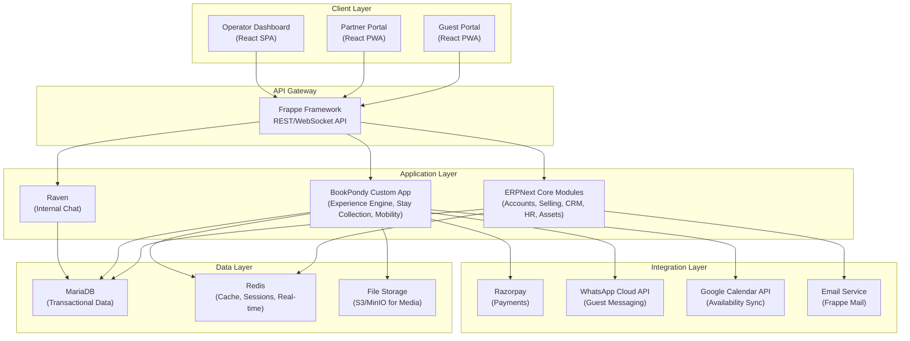
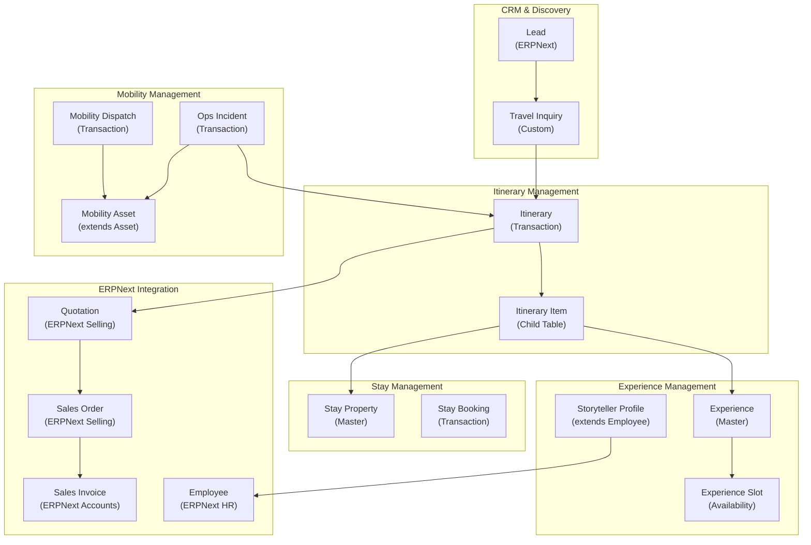
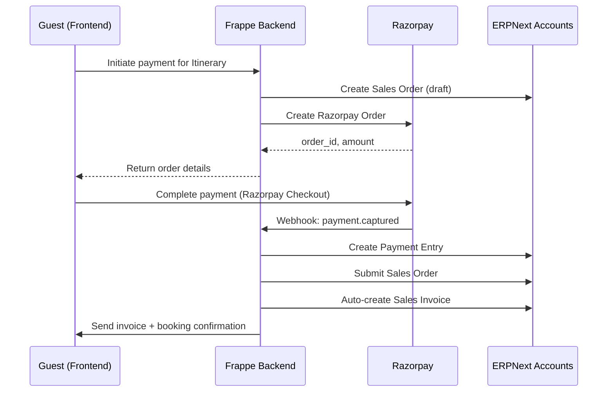
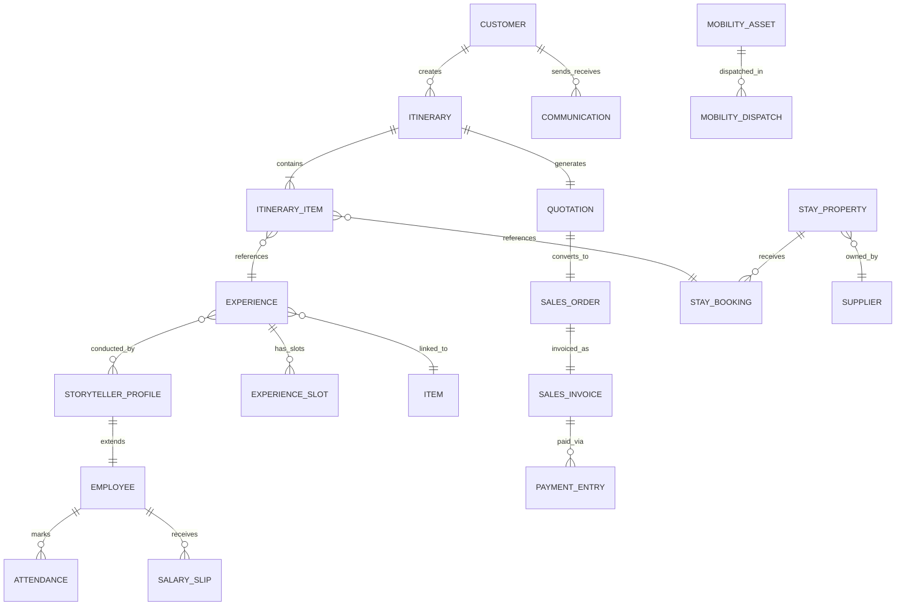
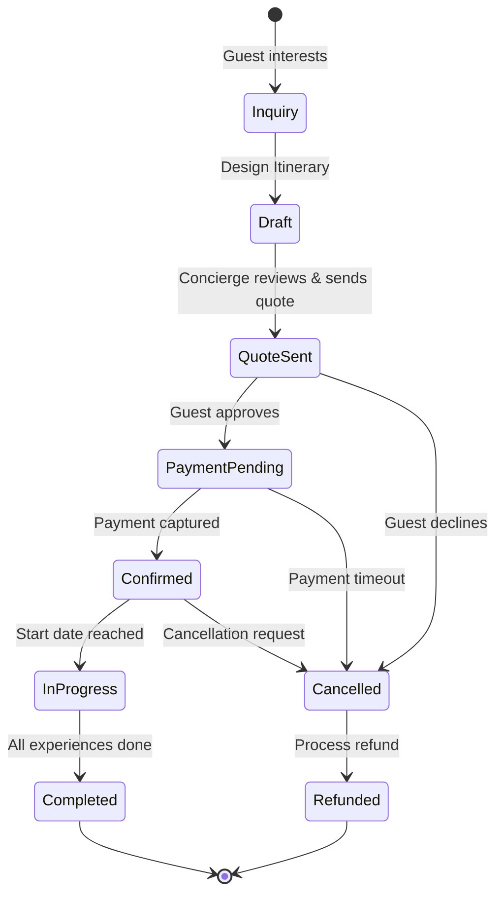
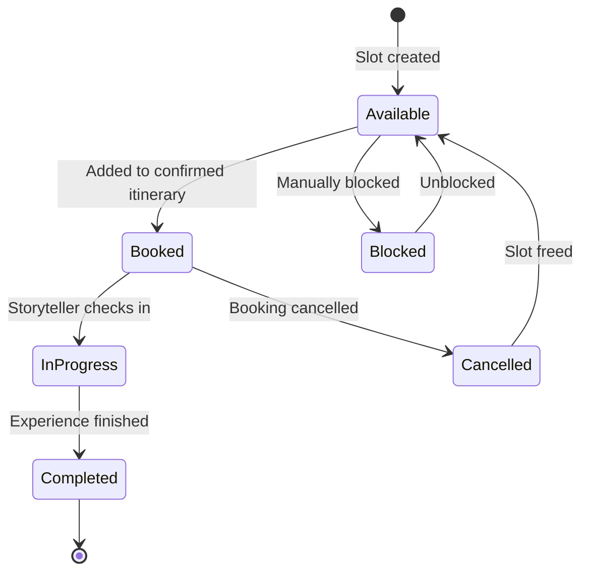

# BookPondy.com — System Design Architecture
## System Design Architect's Understanding, Scope & Context Document

> **Prepared by:** System Design Architect  
> **Date:** February 2, 2026  
> **Version:** 1.0  
> **Status:** Initial Architecture Review

---

## Executive Summary

This document represents the System Design Architect's comprehensive understanding of the BookPondy.com digital transformation initiative. Having reviewed the CTO briefing and company business brief, I present a structured analysis of the system scope, architectural context, and implementation strategy.

### Project Classification
- **Type:** Digital Platform Development (ERP-backed Marketplace)
- **Scale:** Enterprise-grade Travel Experience Management System
- **Complexity:** High — Multi-tenant, multi-role, real-time coordination
- **Timeline:** Phased delivery (MVP: 8-10 weeks, Growth: 6-8 weeks, Scale: Ongoing)

### Architecture Philosophy
> **Build on proven foundations (ERPNext), extend with domain-specific capabilities (Custom Frappe App), deliver through modern UX (React SPA with shadcn/ui).**

---

## Part 1: Understanding & Context

### 1.1 Business Context Understanding

#### The Core Problem We're Solving
BookPondy.com is addressing the **operational chaos of manual, fragmented travel coordination** in the Auroville-Puducherry bioregion. The current state involves:

- 7+ disconnected tools (Google Sheets, WhatsApp, manual Razorpay links, Google Calendar)
- No real-time inventory management
- Manual GST invoice generation
- Fragmented vendor coordination
- Zero data-driven decision making capability

#### The Transformation Goal
Transform from a **manually-operated collective** to a **fully integrated digital platform** that orchestrates:

1. **Guest Journey Management** — Discovery → Booking → Experience → Feedback
2. **Partner Operations** — Availability → Assignment → Execution → Payout
3. **Business Intelligence** — Real-time dashboards, financial compliance, impact tracking

#### Success Criteria
| Stakeholder | Current Pain | Future Success |
|-------------|--------------|----------------|
| **Guests** | 5+ touchpoints, opaque pricing | 1 platform, transparent pricing |
| **Operations Team** | Manual coordination, version chaos | Automated workflows, real-time visibility |
| **Storytellers/Vendors** | Payment delays, unclear schedule | 7-day payouts, self-service portal |
| **Business** | Cannot scale, audit nightmares | 10x capacity, auto GST compliance |

---

### 1.2 Technical Context Understanding

#### Why Frappe/ERPNext Ecosystem?

The briefing clearly mandates the Frappe Framework + ERPNext stack. This is architecturally sound because:

| Requirement | Frappe/ERPNext Solution | Alternative Cost |
|-------------|-------------------------|------------------|
| **GST-compliant invoicing** | Built-in Accounts module | 6-8 weeks custom build |
| **Inventory tracking** | Stock module with batching | 4-6 weeks custom build |
| **CRM with communication log** | CRM module ready | 3-4 weeks custom build |
| **HR/Payroll for storytellers** | HR module with contractors | 6-8 weeks custom build |
| **Asset management (e-bikes)** | Assets module with maintenance | 3-4 weeks custom build |
| **Role-based permissions** | DocPerm framework | 4-5 weeks custom build |
| **REST API auto-generation** | Frappe core feature | Ongoing maintenance burden |

**Architectural Decision Validation:** ✅ Using ERPNext is a **build vs. buy decision that saves 24-32 weeks of development time** while providing battle-tested, audit-ready business modules.

#### Frontend Architecture Choice

The briefing specifies **React SPA via Doppio + shadcn/ui**, inspired by the Raven architecture. This is sound because:

1. **Doppio** — Proven CLI for setting up React SPAs on Frappe apps (used by Raven, Frappe Insights)
2. **shadcn/ui** — Copy-paste components, no external dependencies, Radix UI accessibility
3. **frappe-react-sdk** — Typed hooks for Frappe API, authentication, real-time subscriptions
4. **Raven as Reference** — Production-grade pattern to follow

**Architectural Decision Validation:** ✅ Modern frontend while maintaining tight integration with Frappe backend.

---

### 1.3 Scope Clarity

#### What IS in Scope

##### Core Platform Development
1. **Custom Frappe App: `bookpondy`**
   - Custom DocTypes for travel-specific entities
   - Workflows for booking, dispatch, payout
   - Public APIs for guest-facing operations
   - Integration APIs for Razorpay, WhatsApp, Google Calendar

2. **ERPNext Configuration & Extension**
   - Accounts module configuration (GST, payment gateway integration)
   - Selling module extension (Quotations → Itineraries, Sales Orders → Bookings)
   - CRM customization (guest preferences, travel history)
   - HR module for storyteller management
   - Asset module for mobility fleet
   - Payroll integration for commission calculations

3. **React Frontend (Guest Portal + Partner Portal + Operator Dashboard)**
   - Guest-facing discovery and booking interface
   - Partner portal for storytellers, villa owners, workshop hosts
   - Internal operator dashboard for booking management, dispatch, reporting

4. **Real-time Communication Layer**
   - Raven integration for internal team coordination
   - WhatsApp Cloud API integration for guest messaging
   - Email notifications via Frappe email framework

5. **Third-Party Integrations**
   - Razorpay payment gateway (webhooks, refunds)
   - Google Calendar sync for villa availability
   - GPS/Maps integration for mobility tracking (future)

5. **New Business Components (Post-Review Addition)**
   - **Regenerative Finance Logic:** Community fund calculation & ledger posting (P0)
   - **Pricing Rule Engine:** Seasonal rates and dynamic pricing (P1)
   - **Travel Inquiry System:** Discovery phase workflow (P1)
   - **Operations Incident Management:** Real-time issue tracking (P2)
   - **Waiver Management:** Liability waivers for active experiences (P1)

##### Data Migration & Setup
- Migration from Google Sheets to ERPNext (experiences catalog, partner data)
- Initial villa/property onboarding
- Storyteller profile creation
- Historical booking data import (if applicable)

#### What IS NOT in Scope (Explicitly Out)

| Feature | Reason | Future Phase |
|---------|--------|--------------|
| **Mobile Native Apps (iOS/Android)** | MVP is PWA-first, evaluate post-launch | Phase 3 (via doppio_mobile) |
| **AI-Powered Recommendations** | Requires booking history data | Phase 3 |
| **Multi-language Support** | English-first, add post-MVP | Phase 3 (Q4 2025) |
| **STEAM Camp Booking Module** | Separate initiative, different pricing model | Phase 2 (Jun-Jul 2025) |
| **Multi-currency Support** | INR-only initially | Post-international marketing |
| **Offline Storyteller Check-in** | PWA caching suffices for MVP | Phase 2 if needed |
| **Advanced Analytics/BI** | Basic dashboards in MVP | Phase 3 |
| **Franchise Management Module** | 2027+ roadmap item | Not current scope |

---

## Part 2: System Architecture

### 2.1 High-Level Architecture Overview



### 2.2 Architectural Layers Breakdown

#### Layer 1: Client Layer (Frontend)

**Technology Stack:**
- React 18+ (via Doppio initialization)
- TypeScript (type safety with Frappe DocTypes)
- shadcn/ui components (Radix UI + Tailwind CSS)
- frappe-react-sdk (API hooks, authentication)
- SWR or React Query (data fetching, caching)
- Vite (build tool)

**Three Distinct Interfaces:**

| Interface | Users | Key Screens | Priority |
|-----------|-------|-------------|----------|
| **Guest Portal** | Public, authenticated guests | Home, Experiences, Stays, Itinerary Builder, Checkout, My Trips | P0 |
| **Partner Portal** | Storytellers, villa owners, workshop hosts | Dashboard, Schedule, Availability, Payouts, Profile | P1 |
| **Operator Dashboard** | Internal team (concierge, ops manager, finance) | Bookings, Dispatch, Inventory, Vendors, Reports | P0 |

**Design System:**
- Based on shadcn/ui component library
- Custom theme tokens (terracotta primary, teal accent)
- Google Fonts: Outfit (headings), Inter (body)
- Responsive breakpoints: mobile (< 640px), tablet (640-1024px), desktop (> 1024px)

#### Layer 2: API Gateway (Frappe Framework)

**Frappe REST API Features:**
- Auto-generated CRUD endpoints for all DocTypes
- WhiteList decorators for custom API methods
- Session-based authentication with CSRF protection
- OAuth2 support for mobile apps (future)
- WebSocket support via Socket.io (real-time updates)

**API Design Patterns:**
```python
# Example: Custom API for itinerary builder
@frappe.whitelist()
def get_available_experiences(date, category=None, location=None):
    """
    Returns experiences with real-time availability check
    Used by: Guest Portal - Experience Catalog
    """
    # Implementation with permission checks
    pass

@frappe.whitelist()
def create_bespoke_itinerary(guest_id, items, custom_requests=None):
    """
    Creates Itinerary → Quotation → Sales Order flow
    Used by: Guest Portal - Itinerary Builder
    """
    # Implementation with ERPNext integration
    pass
```

#### Layer 3: Application Layer

##### 3A. ERPNext Core Modules (Configured, Not Customized)

| Module | Configuration | Custom Fields Added |
|--------|---------------|---------------------|
| **Accounts** | GST Settings (33AAATA0037B7Z), Razorpay Payment Gateway | None (use as-is) |
| **Selling** | Enable Quotation workflow, Custom print formats | `quotation_type` = "Bespoke Itinerary" |
| **CRM** | Lead sources, Communication templates | `guest_preferences`, `travel_history_json` |
| **HR** | Enable Contractors, Commission salary components | `storyteller_rating`, `language_skills` |
| **Stock** | Enable Batches for workshop materials | `experience_kit_batch` |
| **Assets** | Maintenance schedules for e-bikes | `gps_tracker_id`, `current_location` |

##### 3B. BookPondy Custom App (Domain-Specific)

**Custom DocTypes Architecture:**



**Key DocType Specifications:**

##### DocType: `Experience`
```python
{
    "name": "EXP-00001",
    "title": "Heritage Walk - French Quarter",
    "category": "Urban Heritage",
    "experience_track": "Puducherry Narrative",
    "duration_hours": 2.5,
    "price_base": 1500,
    "price_premium": 2500,
    "capacity_min": 2,
    "capacity_max": 12,
    "storyteller_commission_percent": 60,
    "description": "...",
    "inclusions": ["..."],
    "exclusions": ["..."],
    "requirements": "Comfortable walking shoes",
    "linked_item": "ITEM-EXP-00001",  # Link to ERPNext Item
    "status": "Active"
}
```

##### DocType: `Itinerary`
```python
{
    "name": "ITIN-2025-00123",
    "guest": "CUST-00045",
    "start_date": "2025-04-15",
    "end_date": "2025-04-18",
    "total_days": 4,
    "items": [
        {
            "date": "2025-04-15",
            "type": "Stay",
            "reference_doctype": "Stay Booking",
            "reference_name": "SB-00234",
            "amount": 12000
        },
        {
            "date": "2025-04-16",
            "type": "Experience",
            "reference_doctype": "Experience",
            "reference_name": "EXP-00001",
            "slot_start": "09:00",
            "storyteller": "EMP-ST-001",
            "amount": 2500
        }
    ],
    "subtotal": 14500,
    "service_fee": 2175,  # 15%
    "gst_amount": 3001.5,  # 18% on subtotal + service fee
    "total_amount": 19676.5,
    "quotation": "QTN-00123",  # Link to ERPNext Quotation
    "sales_order": "SO-00123",  # After payment
    "status": "Confirmed"
}
```

##### DocType: `Storyteller Profile`
```python
{
    "name": "STORY-00001",
    "employee": "EMP-ST-001",  # Link to ERPNext Employee
    "full_name": "Ravi Kumar",
    "languages": ["English", "Tamil", "French"],
    "specializations": ["Heritage Walks", "Temple Trails"],
    "experience_years": 5,
    "rating_average": 4.8,
    "bio": "...",
    "profile_image": "/files/storyteller_ravi.jpg",
    "commission_structure": {
        "heritage_walks": 60,
        "temple_trails": 65,
        "custom_experiences": 70
    },
    "availability_calendar": "CAL-STORY-001",
    "status": "Active"
}
```

#### Layer 4: Data Layer

##### MariaDB Schema Design Principles

1. **Leverage Frappe's DocType Framework** — No raw SQL table creation
2. **Use Child Tables for One-to-Many** — `Itinerary Item`, `Experience Slot`, etc.
3. **Link Fields for Relationships** — Type-safe references between DocTypes
4. **Custom Fields for ERPNext Extensions** — Add to existing DocTypes vs. new tables

##### Indexing Strategy
```sql
-- Auto-created by Frappe, but key indexes to monitor:
CREATE INDEX idx_experience_slot_date ON `tabExperience Slot`(experience, slot_date, status);
CREATE INDEX idx_stay_booking_dates ON `tabStay Booking`(property, check_in_date, check_out_date);
CREATE INDEX idx_itinerary_guest_date ON `tabItinerary`(guest, start_date, status);
```

##### Redis Usage
- **Session storage** — Frappe default
- **Cache layer** — `frappe.cache()` for frequently accessed data (experience catalog)
- **Real-time pub/sub** — Socket.io integration
- **Rate limiting** — API throttling

##### File Storage (S3/MinIO)
```
/bookpondy/
  ├── experiences/
  │   ├── photos/          # Experience gallery images
  │   └── videos/          # Experience preview videos
  ├── properties/
  │   ├── villa_photos/
  │   └── floor_plans/
  ├── storytellers/
  │   └── profiles/
  ├── documents/
  │   ├── invoices/        # Generated PDFs
  │   └── vouchers/
  └── uploads/
      └── guest_documents/ # ID proofs, etc.
```

---

### 2.3 Integration Architecture

#### Integration 1: Razorpay Payment Gateway

**Workflow:**


**Implementation Details:**
- Razorpay Python SDK in `bookpondy/integrations/razorpay.py`
- Webhook endpoint: `/api/method/bookpondy.webhooks.razorpay_webhook`
- Signature verification for security
- Idempotency handling for duplicate webhooks

#### Integration 2: WhatsApp Cloud API

**Use Cases:**
1. Booking confirmations
2. Day-before reminders
3. Real-time updates (storyteller assignment, time changes)
4. Post-experience feedback requests

**Architecture:**
```python
# bookpondy/communication/whatsapp.py
def send_booking_confirmation(booking_id):
    booking = frappe.get_doc("Itinerary", booking_id)
    template = "booking_confirmation_template"
    message = render_whatsapp_template(template, {
        "guest_name": booking.guest_name,
        "start_date": booking.start_date,
        "itinerary_link": f"https://bookpondy.com/my-trips/{booking.name}"
    })
    send_whatsapp_message(booking.guest_mobile, message)
```

#### Integration 3: Google Calendar Sync (Villa Availability)

**Challenge:** Villa owners manage availability in Google Calendar  
**Solution:** Two-way sync via Google Calendar API

```python
# bookpondy/integrations/google_calendar.py
def sync_property_availability(property_id):
    """
    Sync Stay Property availability with owner's Google Calendar
    - Blocked dates in Google Calendar → Mark unavailable in system
    - Bookings in system → Block dates in Google Calendar
    """
    property = frappe.get_doc("Stay Property", property_id)
    calendar_id = property.google_calendar_id
    
    # Fetch blocked dates from Google Calendar
    events = get_calendar_events(calendar_id, start_date, end_date)
    
    # Update Stay Booking unavailability
    for event in events:
        create_or_update_unavailability(property_id, event['start'], event['end'])
```

---

## Part 3: Data Architecture & Domain Model

### 3.1 Core Domain Entities

#### Entity Relationship Overview



### 3.2 Data Model Specifications

#### Customer (ERPNext CRM Extended)

**Base DocType:** `Customer` (ERPNext)  
**Custom Fields:**
- `guest_preferences` (JSON) — Interests, dietary restrictions, accessibility needs
- `travel_history_count` (Int) — Number of completed bookings
- `preferred_language` (Select) — English, French, Tamil, Hindi
- `whatsapp_optin` (Check) — Consent for WhatsApp communication
- `loyalty_tier` (Select) — New, Silver, Gold, Platinum

#### Experience Catalog

**DocType:** `Experience`  
**Key Fields:**
```
- title (Data)
- slug (Data, unique)
- category (Link to Experience Category)
- experience_track (Select: Urban Heritage, Auroville Immersion, Workshops, Sacred Geography)
- description (Text Editor)
- duration_hours (Float)
- capacity_min (Int)
- capacity_max (Int)
- price_base (Currency)
- price_premium (Currency)
- storyteller_commission_percent (Float)
- inclusions (Table: Experience Inclusion)
- requirements (Small Text)
- meeting_point (Data)
- linked_item (Link to Item) — ERPNext Item for selling
- gallery (Attach Multiple) — Photos, videos
- status (Select: Active, Inactive, Seasonal)
```

**Child Table:** `Experience Slot`
```
- experience (Link to Experience)
- slot_date (Date)
- slot_start_time (Time)
- slot_end_time (Time)
- capacity_booked (Int)
- assigned_storyteller (Link to Storyteller Profile)
- status (Select: Available, Booked, In Progress, Completed, Cancelled)
```

#### Stay Property

**DocType:** `Stay Property`
```
- property_name (Data)
- property_type (Select: Franco-Tamil Heritage, Eco-Luxury Villa, Seaside Estate, Boutique Hotel, Homestay)
- owner (Link to Supplier) — ERPNext Supplier
- location (Small Text)
- bedrooms (Int)
- max_guests (Int)
- amenities (Table: Property Amenity)
- price_per_night_base (Currency)
- price_per_night_weekend (Currency)
- commission_percent (Float)
- google_calendar_id (Data) — For availability sync
- gallery (Attach Multiple)
- linked_item (Link to Item) — ERPNext Item for selling
```

#### New Components (CTO Review Additions)

##### DocType: `Travel Inquiry` (Discovery Phase)
- **Base:** Leads -> Opportunity
- **Fields:**
    - `travel_intent` (Select: Leisure, Spiritual, Educational, Remote Work)
    - `vibe_preference` (Select: Quiet/Secluded, Active/Social, Luxe, Rustic)
    - `group_dynamics` (Data: "Family with 2 kids", "Solo female", etc.)
    - `budget_range` (Currency Range)
    - `preferred_dates` (Date Range)
- **Workflow:** New -> Discovery Call Done -> Proposal Sent -> Converted (Creates Itinerary)

##### DocType: `Operation Season` (Pricing Engine)
- **Fields:**
    - `season_name` (Data: "Peak Winter", "Monsoon", "Standard")
    - `start_date` (Date)
    - `end_date` (Date)
    - `price_multiplier` (Float: 1.0, 1.25, 1.5)
- **Logic:** `get_experience_price(date)` queries this to apply `price_premium`.

##### DocType: `Operations Incident`
- **Fields:**
    - `incident_type` (Select: Vehicle Breakdown, Guest Complaint, Injury, No-Show)
    - `severity` (Select: Low, Medium, Critical)
    - `linked_document` (Dynamic Link: Booking, Asset, Slot)
    - `resolution_status` (Select: Open, Investigating, Resolved, Refund Processed)
    - `resolution_notes` (Text)

##### DocType: `Waiver` (Risk Management)
- **Fields:**
    - `guest` (Link: Customer)
    - `activity_type` (Select: E-bike, Forest Walk, Scuba)
    - `booking_reference` (Dynamic Link)
    - `signed_on` (Datetime)
    - `signature_image` (Signature)
    - `terms_version` (Data)

#### Itinerary (Core Transaction DocType)

**DocType:** `Itinerary`
```
- guest (Link to Customer)
- guest_name (Data, fetch from Customer)
- guest_mobile (Data, fetch from Customer)
- guest_email (Data, fetch from Customer)
- start_date (Date)
- end_date (Date)
- total_days (Int, calculated)
- items (Table: Itinerary Item)
- custom_requests (Text)
- concierge_notes (Text)
- subtotal (Currency, calculated)
- service_fee (Currency, calculated)
- community_fund_amount (Currency, calculated) — 3-5% impact fund
- gst_amount (Currency, calculated)
- total_amount (Currency, calculated)
- quotation (Link to Quotation) — ERPNext
- sales_order (Link to Sales Order) — ERPNext
- payment_status (Select: Pending, Partially Paid, Paid, Refunded)
- booking_status (Select: Draft, Quote Sent, Confirmed, In Progress, Completed, Cancelled)
```

**Child Table:** `Itinerary Item`
```
- date (Date)
- item_type (Select: Experience, Stay, Transport, Custom)
- reference_doctype (Data) — Experience, Stay Booking, Mobility Dispatch
- reference_name (Dynamic Link)
- description (Data)
- quantity (Int, default 1)
- rate (Currency)
- amount (Currency, calculated)
```

---

### 3.2.1 Regenerative Finance Logic (New Requirement)

**Objective:** Automatically accrue 3-5% of revenue to a "Community Impact Fund" liability account, ensuring "Radical Transparency".

**Implementation:**
1. **GL Entry Logic:** On `Sales Invoice` submission, a custom Script/GL Entry takes a percentage of the Net Total.
   - **Debit:** Impact Expense Account (P&L)
   - **Credit:** Community Fund Liability Account (Balance Sheet)
2. **Display:** The `community_fund_amount` is shown on the Customer Portal invoice as "Contribution to Bioregion".

### 3.3 Workflow State Machines

#### Booking Workflow



#### Experience Slot Workflow



---

## Part 4: Technical Implementation Strategy

### 4.1 Technology Stack Validation

#### Backend Stack
| Component | Technology | Rationale | Risk Level |
|-----------|------------|-----------|------------|
| Framework | Frappe v15+ | Low-code, auto REST API, workflows | ✅ Low |
| ERP Core | ERPNext v15+ | Proven Accounts, CRM, HR, Asset modules | ✅ Low |
| Database | MariaDB 10.6+ | Frappe default, well-optimized | ✅ Low |
| Cache | Redis 6+ | Real-time, sessions, caching | ✅ Low |
| Language | Python 3.10+ | Frappe requirement | ✅ Low |
| Task Queue | RQ (Redis Queue) | Background jobs, email sending | ✅ Low |

#### Frontend Stack
| Component | Technology | Rationale | Risk Level |
|-----------|------------|-----------|------------|
| Framework | React 18 | Modern, component-based | ✅ Low |
| Build Tool | Vite | Fast HMR, optimized builds | ✅ Low |
| UI Library | shadcn/ui | Copy-paste, accessible, Tailwind | ⚠️ Medium* |
| Type Safety | TypeScript | Catch errors early, better DX | ⚠️ Medium* |
| API Client | frappe-react-sdk | Frappe-specific hooks | ✅ Low |
| State Management | SWR or React Query | Data fetching, caching | ✅ Low |

*Medium risk: Team learning curve, not Frappe-native

#### Integration Stack
| Component | Technology | Rationale | Risk Level |
|-----------|------------|-----------|------------|
| Payments | Razorpay | India-focused, GST support | ✅ Low |
| Messaging | WhatsApp Cloud API | Guest preference | ⚠️ Medium** |
| Calendar | Google Calendar API | Villa owner familiarity | ⚠️ Medium** |
| Email | Frappe Mail | Built-in | ✅ Low |
| Storage | S3/MinIO | Media files | ✅ Low |

**Medium risk: External API dependencies, rate limits, OAuth complexity

### 4.2 Development Environment Setup

#### System Requirements
```yaml
Development Machine:
  - OS: macOS, Ubuntu 20.04+, or WSL2 on Windows
  - RAM: 8GB minimum, 16GB recommended
  - Storage: 20GB free space
  - Python: 3.10+
  - Node: 18+ (for frontend)
  - MariaDB: 10.6+
  - Redis: 6+

Production Server (Frappe Cloud or Self-Hosted):
  - 4 vCPU, 8GB RAM (initially)
  - 100GB SSD storage
  - Ubuntu 22.04 LTS
  - Nginx (reverse proxy)
  - Supervisor (process management)
```

#### Local Development Setup
```bash
# 1. Install Frappe Bench
pip install frappe-bench

# 2. Initialize new bench with ERPNext
bench init bookpondy-bench --frappe-branch version-15 --python python3.10
cd bookpondy-bench
bench get-app erpnext --branch version-15
bench get-app https://github.com/The-Commit-Company/raven

# 3. Create site
bench new-site bookpondy.local --admin-password admin
bench --site bookpondy.local install-app erpnext
bench --site bookpondy.local install-app raven

# 4. Create custom app
bench new-app bookpondy
bench --site bookpondy.local install-app bookpondy

# 5. Setup frontend (Doppio)
cd apps/bookpondy
npx doppio@latest init
# Select: React, TypeScript, Tailwind CSS, shadcn/ui

# 6. Start development
bench start
```

### 4.3 Project Structure

```
bookpondy-bench/
├── apps/
│   ├── frappe/              # Frappe framework
│   ├── erpnext/             # ERPNext
│   ├── raven/               # Internal chat
│   └── bookpondy/           # CUSTOM APP
│       ├── bookpondy/
│       │   ├── public/      # Static assets
│       │   ├── templates/   # Jinja templates
│       │   ├── www/         # Web pages
│       │   ├── api/         # Custom API endpoints
│       │   ├── integrations/
│       │   │   ├── razorpay.py
│       │   │   ├── whatsapp.py
│       │   │   └── google_calendar.py
│       │   ├── experience_management/
│       │   │   ├── doctype/
│       │   │   │   ├── experience/
│       │   │   │   ├── experience_slot/
│       │   │   │   └── storyteller_profile/
│       │   │   └── workflows.py
│       │   ├── stay_management/
│       │   │   └── doctype/
│       │   │       ├── stay_property/
│       │   │       └── stay_booking/
│       │   ├── itinerary_management/
│       │   │   └── doctype/
│       │   │       ├── itinerary/
│       │   │       └── itinerary_item/
│       │   └── mobility_management/
│       │       └── doctype/
│       │           ├── mobility_asset/
│       │           └── mobility_dispatch/
│       ├── frontend/        # React SPA (Doppio)
│       │   ├── src/
│       │   │   ├── components/
│       │   │   │   ├── ui/           # shadcn/ui components
│       │   │   │   ├── common/
│       │   │   │   ├── experience/
│       │   │   │   ├── stays/
│       │   │   │   ├── itinerary/
│       │   │   │   └── dashboard/
│       │   │   ├── pages/
│       │   │   │   ├── Home.tsx
│       │   │   │   ├── Experiences.tsx
│       │   │   │   ├── Stays.tsx
│       │   │   │   ├── ItineraryBuilder.tsx
│       │   │   │   ├── Checkout.tsx
│       │   │   │   └── MyTrips.tsx
│       │   │   ├── hooks/
│       │   │   ├── types/
│       │   │   ├── utils/
│       │   │   ├── App.tsx
│       │   │   └── main.tsx
│       │   ├── package.json
│       │   ├── vite.config.ts
│       │   ├── tailwind.config.js
│       │   └── components.json    # shadcn/ui config
│       ├── hooks.py         # Frappe hooks
│       └── modules.txt       # Module list
├── sites/
│   └── bookpondy.local/
│       ├── site_config.json
│       └── private/
│           └── files/
└── config/
    └── nginx.conf
```

---

## Part 5: Implementation Roadmap

### 5.1 Phased Delivery Strategy

#### Phase 1: MVP (P0 Features) — 8-10 Weeks

**Objective:** Launch a functional booking platform with core guest and operator workflows.

| Week | Focus Area | Deliverables |
|------|------------|--------------|
| **Week 1-2** | Foundation Setup | - Development environment<br/>- ERPNext initial config<br/>- Custom app scaffold<br/>- Frontend setup (Doppio + shadcn/ui) |
| **Week 3-4** | Experience Engine | - Experience DocType<br/>- Experience Slot management<br/>- Storyteller Profile<br/>- Experience catalog API<br/>- Frontend: Experience listing + detail pages |
| **Week 5-6** | Booking Flow | - Itinerary DocType<br/>- Itinerary Builder frontend<br/>- Quotation generation<br/>- Razorpay integration<br/>- Sales Order creation |
| **Week 7-8** | Stay Collection | - Stay Property DocType<br/>- Stay Booking<br/>- Availability calendar<br/>- Frontend: Stay listings + booking |
| **Week 9** | Operator Dashboard | - Booking management table<br/>- Basic reporting<br/>- Status updates<br/>- Assignment workflows |
| **Week 10** | Testing & Launch Prep | - End-to-end testing<br/>- GST invoice validation<br/>- Data migration<br/>- UAT with internal team |

**Success Criteria:**
- ✅ Guest can browse experiences and stays
- ✅ Guest can build itinerary and complete payment
- ✅ System generates GST-compliant invoice
- ✅ Operator can view bookings and assign storytellers
- ✅ Razorpay payment webhook working

#### Phase 2: Growth Features (P1) — 6-8 Weeks

| Week | Focus Area | Deliverables |
|------|------------|--------------|
| **Week 11-12** | Partner Portal | - Storyteller dashboard<br/>- Availability management<br/>- Schedule view<br/>- Payout history |
| **Week 13-14** | Mobility Layer | - Mobility Asset DocType<br/>- Dispatch management<br/>- Fleet tracking<br/>- Integration with bookings |
| **Week 15-16** | Communication | - WhatsApp Cloud API setup<br/>- Automated notifications<br/>- Booking confirmations<br/>- Reminders |
| **Week 17-18** | Advanced Workflows | - Custom request handling<br/>- Concierge approval flows<br/>- Google Calendar sync<br/>- Vendor payout automation |

**Success Criteria:**
- ✅ Storytellers can manage availability independently
- ✅ Mobility dispatch integrated with bookings
- ✅ Automated WhatsApp notifications sent
- ✅ Custom itinerary requests handled via system

#### Phase 3: Scale & Polish (P2-P3) — Ongoing

| Feature | Timeline | Notes |
|---------|----------|-------|
| PWA enhancements | Q3 2025 | Offline support, install prompts |
| Advanced analytics | Q3 2025 | Revenue forecasting, demand analysis |
| Multi-language | Q4 2025 | French, Tamil |
| STEAM camp module | Q2 2025 | Separate booking flow |
| AI recommendations | 2026 | Post data accumulation |

---

### 5.2 Risk Assessment & Mitigation

#### Technical Risks

| Risk | Probability | Impact | Mitigation Strategy |
|------|-------------|--------|---------------------|
| **Frappe learning curve for frontend team** | High | Medium | - Study Raven codebase<br/>- frappe-react-sdk documentation<br/>- Pair programming with experienced Frappe dev |
| **shadcn/ui integration challenges** | Medium | Low | - Start with core components first<br/>- Build in increments<br/>- Fallback to Frappe UI if needed |
| **Razorpay webhook failures** | Medium | High | - Implement retry logic<br/>- Webhook signature verification<br/>- Manual reconciliation dashboard |
| **Google Calendar sync complexity** | High | Medium | - Start with one-way sync (calendar → system)<br/>- Manual override capability<br/>- Defer two-way sync to Phase 2 |
| **Real-time availability conflicts** | Medium | High | - Database-level locking on booking<br/>- Refresh availability before payment<br/>- Clear error messaging |
| **Data migration from Google Sheets** | Medium | Medium | - CSV import templates<br/>- Data validation scripts<br/>- Phased migration, not big-bang |

#### Business Risks

| Risk | Probability | Impact | Mitigation Strategy |
|------|-------------|--------|---------------------|
| **User adoption (partners resist change)** | High | High | - Extensive partner training<br/>- Dual-run period (manual + platform)<br/>- Dedicated support during transition |
| **GST compliance errors** | Low | Critical | - Leverage ERPNext's proven Accounts module<br/>- Audit by CA before launch<br/>- Test with real transactions in staging |
| **Payment gateway downtime** | Low | High | - Monitor Razorpay status page<br/>- Backup manual payment option<br/>- Clear communication to guests |
| **Scope creep delaying MVP** | High | High | - Strictly enforce P0/P1/P2 prioritization<br/>- Weekly sprint reviews<br/>- "No" to features outside phase scope |

---

## Part 6: Open Questions & Decisions Needed

### 6.1 Critical Decision Points

These questions from the CTO briefing require answers before detailed design:

#### 1. Hosting Decision
**Question:** Frappe Cloud vs. Self-Hosted?

| Option | Pros | Cons | Recommendation |
|--------|------|------|----------------|
| **Frappe Cloud** | - Managed infrastructure<br/>- Auto-scaling<br/>- Built-in backups<br/>- SSL, CDN included | - Monthly cost (~$50-150)<br/>- Less control over server | ✅ **Recommended for MVP**<br/>Focus on product, not DevOps |
| **Self-Hosted** | - Full control<br/>- Lower long-term cost<br/>- Custom server config | - DevOps overhead<br/>- Need to manage backups, SSL, scaling | Consider post-PMF (Product-Market Fit) |

**My Recommendation:** Start with Frappe Cloud for 6-12 months, migrate to self-hosted once operational patterns stabilize.

#### 2. Mobile Strategy
**Question:** React PWA first, or React Native?

| Approach | Timeline | Justification |
|----------|----------|---------------|
| **PWA (React)** | Phase 1-2 | - Same codebase as web<br/>- Installable on mobile<br/>- 90% of native features for this use case |
| **React Native** | Phase 3 (2026) | - Only if need GPS tracking, push notifications, offline-first<br/>- Consider doppio_mobile |

**My Recommendation:** PWA first. Evaluate native app only if analytics show significant mobile-only engagement.

#### 3. Offline Support for Storytellers
**Question:** Do storytellers need offline check-in capability?

**Analysis:**
- Auroville/Puducherry has decent 4G coverage
- Critical check-ins can use SMS fallback
- PWA caching can buffer basic operations

**My Recommendation:** 
- **Phase 1:** Online-only, with manual backup (phone call)
- **Phase 2:** PWA caching for read-only schedule
- **Phase 3:** Evaluate offline-first if field issues arise

#### 4. Calendar Sync Approach
**Question:** Google Calendar API vs. alternatives?

**My Recommendation:**
- **Phase 1:** Manual availability entry by partners (avoid OAuth complexity)
- **Phase 2:** Google Calendar **one-way sync** (calendar → system)
- **Future:** Two-way sync if partners demand it

#### 5. Data Model Review
**Question:** Core DocType relationships validation

**Required Action:** CTO to review the ERD diagrams in Section 3.1 and confirm:
- Are `Itinerary → Quotation → Sales Order` linkages correct?
- Should `Stay Booking` be a separate DocType or child table?
- How to handle multi-day stay pricing (per-night vs. package)?

---

### 6.2 Assumptions Made

I have proceeded with the following assumptions. Please validate:

| Assumption | Impact if Wrong | Validation Needed |
|------------|-----------------|-------------------|
| All storytellers have smartphones | Medium | Survey storyteller network |
| Villa owners can provide Google Calendar links | Low | Fallback: manual entry |
| Razorpay supports INR-only initially | Low | Confirmed in briefing |
| Guests are comfortable with digital payments | Medium | Backup: bank transfer option |
| ERPNext v15 is stable for production use | High | Check current version status |
| No legacy booking data needs migration | Medium | Confirm with operations team |

---

## Part 7: Success Metrics & KPIs

### 7.1 Technical Success Metrics

| Metric | Target | Measurement Method |
|--------|--------|-------------------|
| **Page Load Time** | < 2 seconds (4G) | Lighthouse, WebPageTest |
| **API Response Time** | < 500ms (p95) | Frappe monitoring, APM |
| **Uptime** | 99.5% | Uptime monitoring (UptimeRobot) |
| **Payment Success Rate** | > 95% | Razorpay dashboard vs. attempts |
| **Mobile Responsiveness** | 100% screens | Manual testing + Cypress |

### 7.2 Business Success Metrics

| Metric | Baseline (Manual) | Target (Platform) | Timeline |
|--------|-------------------|-------------------|----------|
| **Time to Quote** | 24-48 hours | < 2 hours | Phase 1 |
| **Booking Conversion Rate** | ~30% | > 50% | 3 months post-launch |
| **Vendor Payout Time** | 15-30 days | 7 days | Phase 2 |
| **Customer Support Tickets** | 20/week | < 10/week | 6 months post-launch |
| **Platform Bookings** | 0% | 80% of total | 12 months |

### 7.3 User Adoption Metrics

| User Type | Adoption Metric | Target | Timeline |
|-----------|----------------|--------|----------|
| **Guests** | % bookings via platform (vs. WhatsApp) | 60% | 6 months |
| **Storytellers** | % managing own availability | 70% | Phase 2 + 3 months |
| **Villa Owners** | % with live calendar | 50% | Phase 2 + 6 months |
| **Operations** | % reduction in manual coordination | 80% | 12 months |

---

## Part 8: Next Steps & Immediate Actions

### 8.1 Pre-Development Checklist

Before writing a single line of code:

- [ ] **Validate this architecture document** with stakeholders
- [ ] **Answer open questions** in Section 6.1
- [ ] **Conduct storyteller survey** on smartphone access, digital literacy
- [ ] **Audit current Google Sheets data** for migration readiness
- [ ] **Obtain Razorpay merchant account** and test API keys
- [ ] **Decide on hosting** (Frappe Cloud preferred)
- [ ] **Set up project management** (GitHub Projects, Linear, or Frappe Desk)
- [ ] **Establish code repository** (GitHub with branch protection)
- [ ] **Define team structure** (Frontend dev, Backend dev, QA, Product Owner)

### 8.2 Week 1 Action Plan

| Day | Activity | Owner | Output |
|-----|----------|-------|--------|
| **Day 1** | Environment setup (local bench, ERPNext install) | Backend Dev | Working local instance |
| **Day 2** | Create `bookpondy` custom app, initialize Doppio frontend | Full Stack | App scaffold ready |
| **Day 3** | ERPNext configuration (Company, GST, Fiscal Year) | Backend Dev | Base ERP configured |
| **Day 4** | shadcn/ui setup, design system tokens (colors, fonts) | Frontend Dev | Component library ready |
| **Day 5** | Sprint planning, first DocType design (Experience) | Team | Sprint 1 backlog finalized |

### 8.3 Immediate Stakeholder Communication

**To Founder:**
> "I've completed the system architecture review. The Frappe/ERPNext stack is sound and will save 24-32 weeks of development time. Key decisions needed: hosting (recommend Frappe Cloud initially) and mobile strategy (PWA first). Ready to proceed pending your approval of this architecture."

**To Operations Team:**
> "We'll need to audit your current Google Sheets to prepare for data migration. Also, please survey storytellers on smartphone access and comfort with digital tools. This will inform our offline support strategy."

**To Finance:**
> "ERPNext's Accounts module will handle GST compliance, but I recommend a CA audit of our configuration before launch. We'll leverage battle-tested invoicing rather than custom-building."

---

## Part 9: Conclusion

### 9.1 Architecture Summary

The BookPondy.com platform will be built on a **three-layer architecture**:

1. **Foundation Layer:** ERPNext provides Accounts, CRM, HR, Assets — saving months of development
2. **Domain Layer:** Custom `bookpondy` Frappe app adds travel-specific DocTypes and workflows
3. **Experience Layer:** Modern React SPA with shadcn/ui for beautiful, accessible interfaces

This approach balances **speed to market** (leverage ERPNext) with **differentiation** (custom travel features) and **user experience** (modern frontend).

### 9.2 Confidence Assessment

| Aspect | Confidence Level | Rationale |
|--------|------------------|-----------|
| **Technical Feasibility** | ✅ **High** | Proven stack (Frappe/ERPNext), reference architecture (Raven) |
| **Timeline Achievability** | ⚠️ **Medium-High** | 8-10 weeks is aggressive but achievable with disciplined scope |
| **Team Capability** | ⚠️ **TBD** | Depends on Frappe experience; learning curve mitigated by docs + Raven study |
| **Business Alignment** | ✅ **High** | Architecture directly addresses manual operations pain points |
| **Scalability** | ✅ **High** | Frappe scales to millions of records; ERPNext used by 10K+ companies |

### 9.3 Final Recommendation

**Proceed with development** under the following conditions:

1. ✅ **Approve this architecture** as the blueprint (with refinements as needed)
2. ✅ **Start with Frappe Cloud hosting** to accelerate MVP launch
3. ✅ **Commit to PWA-first** mobile strategy (defer native app)
4. ✅ **Strict P0/P1/P2 prioritization** — no scope creep in MVP
5. ✅ **Weekly stakeholder demos** to maintain alignment
6. ⚠️ **Budget for Frappe/React training** if team lacks experience

**This is a bold, achievable vision. Let's build it systematically.**

---

## Appendix A: Glossary

| Term | Definition |
|------|------------|
| **DocType** | Frappe's abstraction for database tables + metadata (forms, permissions, workflows) |
| **Frappe Bench** | Development tool for managing Frappe sites and apps |
| **Doppio** | CLI tool for initializing React SPAs on Frappe apps |
| **frappe-react-sdk** | React hooks library for Frappe API integration |
| **Raven** | Reference Frappe app (internal chat) demonstrating React + Frappe patterns |
| **shadcn/ui** | Component library built on Radix UI and Tailwind CSS |
| **Sales Order** | ERPNext DocType representing a confirmed booking/sale |
| **Quotation** | ERPNext DocType representing a price estimate before confirmation |
| **Child Table** | Frappe DB pattern for one-to-many relationships (e.g., Itinerary Items) |

---

## Appendix B: Reference Links

| Resource | URL | Purpose |
|----------|-----|---------|
| **Frappe Docs** | https://frappeframework.com/docs | Framework reference |
| **ERPNext User Manual** | https://docs.erpnext.com | ERP module usage |
| **Raven Source Code** | https://github.com/The-Commit-Company/raven | Architecture reference |
| **Doppio** | https://github.com/NagariaHussain/doppio | React SPA setup |
| **frappe-react-sdk** | https://www.npmjs.com/package/frappe-react-sdk | React integration |
| **shadcn/ui** | https://ui.shadcn.com | Component library |
| **Razorpay Docs** | https://razorpay.com/docs | Payment integration |

---

**Document Status:** ✅ Ready for Review  
**Next Action:** Stakeholder approval + decision on open questions  
**Prepared By:** System Design Architect  
**Date:** February 2, 2026
