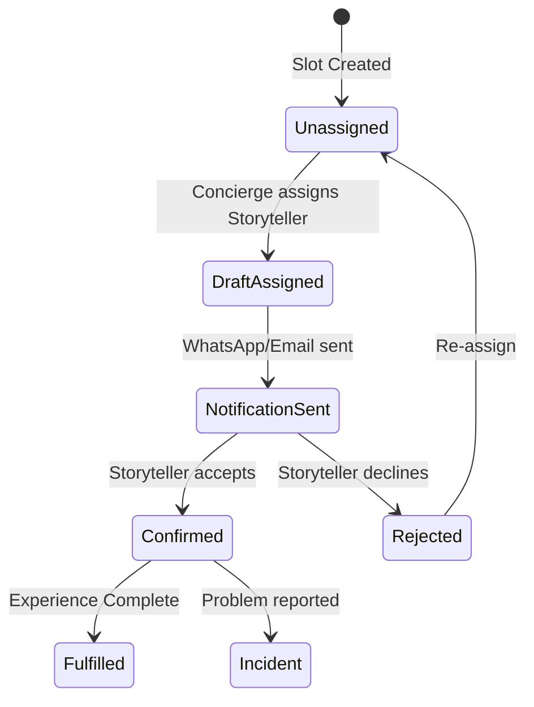

# BookPondy.com — Enterprise Technical Specification (Core Application)

> **Version:** 2.0 (Enterprise Grade)  
> **Date:** February 2, 2026  
> **Author:** System Design Architect
> **Status:** Draft for Technical Review

---

## 1. System Foundation: Roles, Permissions & User Types

BookPondy.com requires a sophisticated Role-Based Access Control (RBAC) system to manage internal team members, external partners, and various tiers of collaborators.

### 1.1 Role Hierarchy

| Role | Type | Scope | Key Permissions |
|------|------|-------|-----------------|
| **Guest** | User | Website / PWA | Read Experience/Stay, Manage own Itineraries |
| **Storyteller** | User | Partner Portal | View Assignments, Check-in/out, View Payouts |
| **Partner (Stay/Workshop)** | User | Partner Portal | Manage Availability, View own Bookings |
| **Booking Agent** | User | Agent Portal | Create Itineraries for Guests, View Commissions |
| **Concierge** | Desk | ERPNext Desk | Full CRM, Itinerary approval, Dispatch |
| **Operations Manager** | Desk | ERPNext Desk | Inventory/Asset Master, Payout approvals |
| **Finance** | Desk | ERPNext Desk | General Ledger, GST Filing, Commission Settlements |
| **Admin** | Desk | ERPNext Desk | System Configuration, DocType overrides |

### 1.2 Permission Matrix (Simplified)

| DocType | Guest | Storyteller | Partner | Agent | Concierge |
|---------|-------|-------------|---------|-------|-----------|
| `Experience` | Read | Read | Read | Read | Full |
| `Experience Slot` | - | Read* | Read* | Read | Full |
| `Itinerary` | Own | - | - | Own | Full |
| `Stay Property` | Read | - | Own | Read | Full |
| `Storyteller Profile` | Read | Own | - | - | Full |
| `Travel Inquiry` | - | - | - | Own | Full |

*\*Read access limited to slots assigned to them.*

---

## 2. Partner Management & Operations

### 2.1 DocType: `Storyteller Profile`
**Purpose:** External-facing profile for cultural interpreters, linked to internal HR records.
**Extends:** `Employee` (via Link)

| Fieldname | Fieldtype | Options/Label | Mandatory | Notes |
|-----------|-----------|---------------|-----------|-------|
| `employee` | Link | Employee | Yes | Link to HR Employee record |
| `full_name` | Data | display | Yes | Fetch from Employee |
| `bio` | Text Editor | Bio | Yes | Website display bio |
| `languages` | Table | Storyteller Language | Yes | Child table |
| `expertise` | Table | Storyteller Expertise | Yes | Child table (e.g. History, Art) |
| `base_location`| Select | Puducherry, Auroville | Yes | |
| `rating` | Float | Rating | No | Calculated from Guest Feedback |
| `payout_type` | Select | Per Session, Commission | Yes | |
| `commission_pct`| Percent | Commission % | No | If payout_type = Commission |
| `session_rate` | Currency | Rate per Session | No | If payout_type = Per Session |

### 2.2 DocType: `Travel Agent`
**Purpose:** Manage 3rd-party agents bringing bookings (B2B).
**Extends:** `Sales Partner` (link)

| Fieldname | Fieldtype | Options/Label | Mandatory | Notes |
|-----------|-----------|---------------|-----------|-------|
| `agent_name` | Data | Agent Name | Yes | |
| `sales_partner` | Link | Sales Partner | Yes | ERPNext link |
| `agent_tier` | Select | Bronze, Silver, Gold | Yes | Determines commission override |
| `default_commission`| Percent | | Yes | |
| `contact_person`| Data | | Yes | |
| `portal_access` | Check | | No | Enable custom Agent Portal |

---

## 3. The Core Experience Engine

### 3.1 DocType: `Experience` (Master Data)
**Purpose:** Canonical definition of an experience.

| Fieldname | Fieldtype | Options/Label | Mandatory | Notes |
|-----------|-----------|---------------|-----------|-------|
| `title` | Data | Title | Yes | |
| `category` | Link | Experience Category | Yes | |
| `track` | Select | Pondy Narrative, Auroville Laboratory, etc. | Yes | |
| `base_price` | Currency | Off-Peak Price | Yes | Base rate for 1 pax |
| `premium_price` | Currency | Peak Price | Yes | Multiplied by Operation Season |
| `partner` | Link | Supplier | No | If hosted by external partner |
| `storyteller_pool`| Table | Experience Storyteller | No | Child table of allowed storytellers |
| `waiver_required`| Check | | No | If Checked, triggers Digital Waiver logic |

### 3.2 DocType: `Experience Slot` (Transaction)
**Purpose:** A bookable instance of an experience on a specific date/time.

| Fieldname | Fieldtype | Options/Label | Mandatory | Notes |
|-----------|-----------|---------------|-----------|-------|
| `experience` | Link | Experience | Yes | |
| `date` | Date | | Yes | |
| `slot_start` | Time | | Yes | |
| `capacity` | Int | | Yes | Fetch from Experience |
| `booked_qty` | Int | | No | Read Only (calculated) |
| `storyteller` | Link | Storyteller Profile | Yes | **THE ASSIGNMENT FLOW** |
| `status` | Select | Available, Booked, Fulfilled | Yes | |

---

## 4. Stay & Mobility Modules

### 4.1 DocType: `Stay Property`
**Purpose:** Manage villa/hotel master data.

| Fieldname | Fieldtype | Options/Label | Mandatory | Notes |
|-----------|-----------|---------------|-----------|-------|
| `property_name` | Data | | Yes | |
| `owner` | Link | Supplier | Yes | |
| `property_type` | Select | Heritage, Eco-Luxe, Homestay | Yes | |
| `rooms` | Int | Number of Rooms | Yes | |
| `address` | Small Text | | Yes | |
| `amenities` | Table | Property Amenity | No | Child table |
| `calendar_sync_id`| Data | Google Cal ID | No | Used for iCal/API background sync |
| `commission_pct` | Percent | | Yes | |
| `check_in_time` | Time | | Yes | |
| `check_out_time` | Time | | Yes | |

### 4.2 DocType: `Mobility Asset`
**Purpose:** Fleet management (E-bikes, Cars).
**Extends:** `Asset` (link)

| Fieldname | Fieldtype | Options/Label | Mandatory | Notes |
|-----------|-----------|---------------|-----------|-------|
| `asset_name` | Data | | Yes | |
| `asset_link` | Link | Asset | Yes | Link to Fixed Asset record |
| `make_model` | Data | | Yes | |
| `license_plate` | Data | | No | For motorized |
| `current_status`| Select | Parking, In Use, Maintenance | Yes | |
| `battery_level` | Percent | | No | If Electric |
| `last_serviced` | Date | | No | |
| `assigned_driver`| Link | Employee | No | |

---

## 5. Enterprise Business Logic Flows

### 5.1 Storyteller Assignment Workflow

1. **Creation**: `Experience Slot` is created (automatically for recurring or manually).

2. **Availability**: System cross-references `Employee Check-in` / `Leave Application` in ERPNext for the assigned Storytellers.
3. **Draft Assignment**: Concierge assigns a Storyteller based on expertise.
4. **Notification**: Storyteller receives WhatsApp/Push notification.
5. **Acceptance**: Storyteller confirms via Partner Portal (Status changes to `Confimed`).

### 5.2 The "Regenerative" Accounting Logic
On `Sales Invoice` Submission (Custom Hook):
1. **Calculate Impact**: Read `community_fund_amount` from `Itinerary`.
2. **GL Entry (Liability)**:
   - **Credit**: `Community Impact Liability Account` (Current Liability)
   - **Debit**: `Cost of Services (Impact)` (Expense)
3. **Payment Reconciliation**: When payout is made to a green-belt NGO, this liability is cleared.

### 5.3 Travel Agent Commission Logic
1. `Itinerary` is tagged with `Travel Agent`.
2. On payment confirmation, a `Commission Note` is auto-generated.
3. **Calculation**: `Net Booking Value` * `Agent.default_commission`.
4. **Settlement**: Finance reviews monthly Commission Notes and creates `Purchase Invoice` for the Agent.

---

## 6. API Specification (Expanded)

### 6.1 Guest Catalog API
`GET /api/method/bookpondy.api.catalog.get_all`
- Filters: `date`, `track`, `price_range`.

### 6.2 Partner Portal: Assignment Check-in
`POST /api/method/bookpondy.api.ops.mark_attendance`
- Params: `slot_id`, `guest_id`, `status` (Present/No-Show).

### 6.3 Agent Portal: Check Booking Status
`GET /api/method/bookpondy.api.agent.get_bookings`
- Returns: List of itineraries tagged to the `Sales Partner` of the Agent.

---

## 7. Integration Matrix

| System | Integration Type | Business Value |
|--------|------------------|----------------|
| **Razorpay** | Flow-based Checkout | Secure, multi-mode payments |
| **WhatsApp (Wati/Zoko)**| Webhook / Outbound | Confirmed, Reminders, Check-in alerts |
| **Google Calendar** | iCal / API Sync | Multi-property stay management |
| **SendGrid** | SMTP / API | Professional branded PDF vouchers |

---

> **Authorization**: This document is the proprietary specification for BookPondy Experiences Pvt Ltd.  
> **Engineering Note**: Core logic must reside in `bookpondy` app hooks to ensure ERPNext updates do not break customization.
